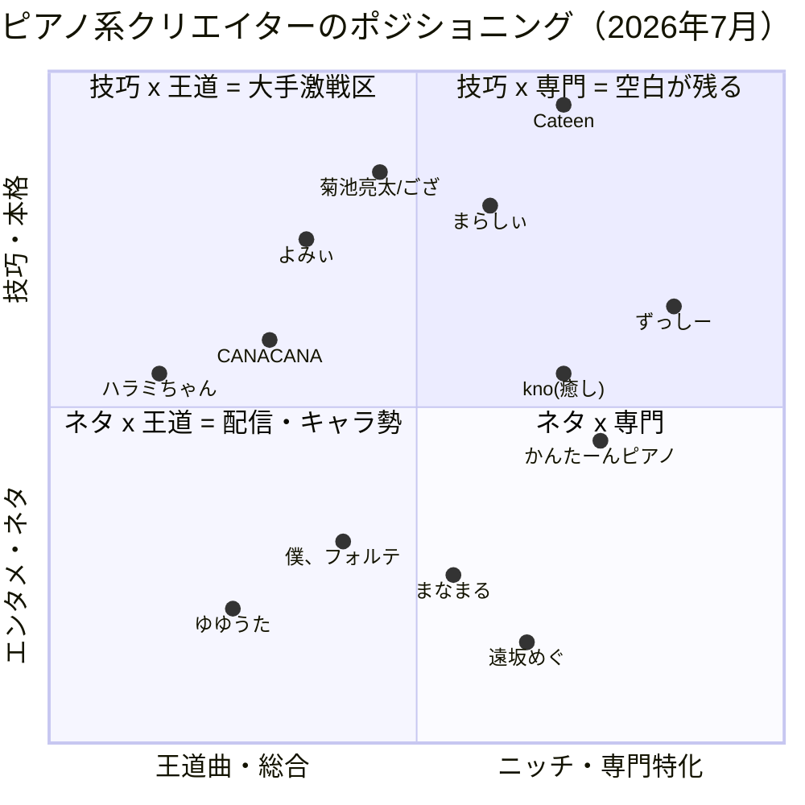

# 02. 競合分析 — 演奏系SNSクリエイター（日本・2026年7月）

> 調査日: 2026-07-18。登録者数は[ユーチュラ](https://yutura.net/)（2026-07-18取得）・[あちこちデータ](https://achikochi-data.com/youtube_subscriber_ranking_piano/)（2026-05〜07更新）ベース。時点を必ず併記。個別動画の再生回数は取得制限のため原則未確認。

## TL;DR

1. **総合カバー型の大手は頭打ち**。ハラミちゃんは約17ヶ月で+3万人（227万→230万）とほぼ横ばい。いま伸びているのは「ポジションをずらした」プレイヤー（ショート特化のゆしん、ネタ特化の遠坂めぐ等）。
2. 新規参入の必須条件は**「何の専門店か」を一言で言える設計**。総合カバー型・屋外ストリートピアノ依存型・単発トレンド追い型は避ける。
3. 特定した空白地帯のうち本プロジェクトに関係が深いのは: **①特定アーティスト専門の演奏×解説（サカナクション級でも不在）②データ・検証系演奏コンテンツ（ほぼ未開拓）③解説×ショート ④大人初心者に伴走する「推せる先生」枠**。

---

## 1. 競合マップ

### 1-A. ピアノ系・大手（登録者100万人前後〜）

| 名前 | 登録者数（時点） | 主力形式 | 差別化 |
|---|---|---|---|
| よみぃ | 250万（2026-07-18） | ストピ×アニソン・東方・音ゲー、ピアノドッキリ | オタク文化圏×超絶技巧。ドッキリの型を確立し量産 |
| ハラミちゃん | 230万（2026-07-18） | ストピ×ポップス、リクエスト即興 | お茶の間最大手。武道館・TV常連。**直近17ヶ月ほぼ横ばい** |
| まらしぃ | 205万（2026-06-19） | ボカロ・東方の高速アレンジ | 「弾いてみた」文化の草分け（2008年〜）。固定ファン厚い |
| CANACANA family | 188万（2026-06-19） | 高音質・丁寧なカバー（長尺・手元） | BGM/作業用+海外視聴者。楽譜連動 |
| 鈴木ゆゆうた | 165万（2026-06-19） | **演奏×トーク配信**・ネタ演奏 | 「新宝島」が代名詞。音楽×雑談の境界を独占 |
| Cateen（角野隼斗） | 158万（2026-07-18） | クラシック×即興・自作アレンジ | ショパコン2021セミファイナルの「本物の権威」。投稿は低頻度 |
| けいちゃん | 141万（2026-06-19） | 耳コピ・マッシュアップ・ストピ | TBS「THE TIME,」レギュラーで地上波接点 |
| ゆしん -Yushin- | 137万（2026-06-19） | **ショート特化**のピアノ弾き語り・オリジナル | 大手カバー勢の隙間から急浮上した新興 |
| 菊池亮太 | 88万（2026-07-18） | 耳コピ即興・ジャズ・配信 | 「何でも即興で弾ける」技術系最高峰 |

### 1-B. 中堅〜新興（抜粋）

| 名前 | 登録者数（時点） | ニッチ |
|---|---|---|
| 826aska | 89.8万（2026-06-19） | エレクトーン（楽器独占） |
| kno Piano Music | 89.7万＋Disney専門サブ22.5万（2026-05〜06） | ジブリ/ディズニー癒し・作業用 |
| まなまる | 72.4万（2026-06-19） | 声真似（まる子）×ジャズ弾き語り |
| 遠坂めぐ | 56.1万（2026-06-19） | 「弾きながら関係ない話」ネタ×週次配信 |
| かんたーんピアノ | 50.1万（2026-06-19） | 初心者向け簡単アレンジ講座 |
| 深根 / Fukane | 39.3万（2026-06-19） | ボカロ・ヨルシカ系＋楽譜販売 |
| ふみ | 35.4万（2026-06-19） | ストピ＋ポケモン文脈 |
| TAKU-音（石井琢磨） | 34.3万（2026-05-20) | ウィーン在住・海外ストピ×クラシック権威 |
| 僕、フォルテ | 30.7万（2026-05-20） | マッチョ×ピアノのギャップ芸 |
| ござ | 26.8万（2026-05-20） | 即興アレンジ・玄人人気・配信 |
| みやじゅん | 24.3万（2026-05-20） | 「ジャズ風にしてみた」特化 |
| ずっしー | 20.2万（2026-05-20） | **耳コピ・音楽理論の解説特化**。書籍化 |

### 1-C. 他楽器・参考（比較用）

| 名前 | 楽器 | 登録者数（時点） | 備考 |
|---|---|---|---|
| Ichika Nito | ギター | 276万（2026-06-18） | 短尺オリジナルフレーズ。海外ファン主体 |
| Seiji Igusa / 粉ミルク | ギター | 各122万（2026-06-18） | フィンガースタイル／顔出しなし弾き語り |
| ふぁみ。 | ベース | 69.8万（2026-03-17） | 「楽器内No.1」をショートで確立→バンド加入で権威化 |
| 826aska | エレクトーン | 89.8万 | 同上 |
| AYASA／ユッコ・ミラー／むらたたむ | バイオリン/サックス/ドラム | 未確認 | ピアノ大手の1/5以下の規模感。楽器内No.1は取りやすい |

### 1-D. 海外勢（日本のアニメ曲需要を回収している競合）

Pan Piano（台湾）379万、Animenz（独）236万、SLSMusic（台湾）52.2万（いずれも2026-06-19時点）。アニメ曲ピアノの検索面はこの海外勢と競合する。

---

## 2. ポジショニングマップ

**読み方**: 右上（技巧×専門特化）は Cateen（クラシック）とずっしー（理論）が点在するのみで、「特定アーティスト深掘り」「データ検証」「解説×ショート」の席が空いている。左上（技巧×王道）は250万級がひしめく激戦区で、新規参入の期待値が最も低い。

---

## 3. ニッチ成功事例 — 勝ちパターン分析

| 事例 | 規模（時点） | ニッチ | 勝因 | 本プロジェクトへの示唆 |
|---|---|---|---|---|
| ゆしん | 137万（2026-06） | ショート特化×弾き語り×オリジナル | 技巧勝負を避け、量産×アルゴリズムで浮上 | ショート起点は後発の定石 |
| 遠坂めぐ | 56.1万（2026-06） | 「弾きながらキレる」お笑いフォーマット | TikTok毎日投稿→1本のバズ→型の反復。人格で記憶される | 「型」を1つ作って反復する設計 |
| かんたーんピアノ | 50.1万（2026-06） | 初心者向け講座 | 「曲名+簡単+楽譜」検索需要を独占。ヒット曲を即・講座化 | 検索資産型は後発でも積める |
| 僕、フォルテ | 30.7万（2026-05） | マッチョ×ピアノ | サムネ1枚で伝わるギャップ。「一言で説明できるキャラ」 | 属性の掛け算（経営者×ピアノも同型） |
| TAKU-音 | 34.3万（2026-05） | ウィーン在住×海外ストピ | 経歴（国際コンクール）×ロケ地で差別化 | 「本物感」の担保は効く |
| ふぁみ。 | 69.8万（2026-03） | ベース×過激テクショート | 競合の少ない楽器内No.1→「本物」の裏付けで飛躍 | 楽器内でなく「切り口内No.1」を取る |
| ずっしー | 20.2万（2026-05） | 耳コピ理論の解説 | 20万登録でも書籍・教材で登録者数以上のマネタイズ。動画が資産化 | 解説は少数登録でも影響力・収益が立つ |
| まなまる | 72.4万（2026-06） | 声真似×ジャズ | 国民的IPで非音楽層を取り込み | 「音楽外の入口」を設計する |

**共通項**: ①演奏の上手さ「だけ」で勝負していない ②一言で説明できる ③型を作って反復 ④検索または人格で資産化。

---

## 4. 企画フォーマット類型と本プロジェクトでの適性

| フォーマット | 代表 | 状況 | 適性判断 |
|---|---|---|---|
| ストリートピアノ | ハラミ、よみぃ他 | **成熟期＋逆風**（撤去・炎上: 加古川2023、南港2025。[J-CAST](https://www.j-cast.com/2025/03/27502863.html?p=all)） | ✕ 主軸にしない。ストピ文法（ギャップ・観客リアクション）は屋内に移植 |
| ドッキリ・ギャップ系 | よみぃ | 非ファン層に届く鉄板型だが大手が量産済み | △ 撮影コスト高。後述の「属性ギャップ」で代替 |
| 初見・難曲チャレンジ | よみぃ（RUSH E等） | 技巧の可視化に有効 | ○ 技巧枠として月1程度 |
| 耳コピ・即興 | 菊池、ござ、けいちゃん | 大手のコア能力。配信と相性良 | △ 中期（ライブ配信導入後） |
| 難易度レベル別 | 「Level 1→100」型 | 1本で初心者〜ガチ勢両取り | ◎ ショート向きの再現性ある型 |
| 解説・講座系 | ずっしー、かんたーん | 爆発力は低いが検索資産・転換率高 | ◎ 差別化の主軸候補（後発でも積める） |
| 演奏×トーク配信 | ゆゆうた、遠坂めぐ | コミュニティ化・課金と相性 | ○ Phase 2以降 |
| 作業用BGM長尺 | kno、海外勢 | 国内勢は手薄 | ○ ストック資産として月1 |

---

## 5. サカナクション曲カバーの飽和度（重要）

- **新宝島**: 超飽和。ゆゆうたの代名詞（「ピアノ協奏曲『新宝島』」企画まで存在）。楽譜市場（Piascore/ELISE/U-FRET）も完備。**単発カバーで差別化は不可能**
- **怪獣**: リリース1年半で単発カバー・楽譜とも飽和（CANACANA、ゆゆうた×atagi、ばーんミュージック講座、Piascore/MuseScore多数）
- **ただし**: サカナクション（≒山口一郎）を**専門に深掘る演奏×解説チャンネルは確認できず**。単発カバーと楽譜のみ。「曲単位」は飽和、「アーティスト単位の縦深掘り」は空白
- 検索需要は増加中: 怪獣のMAJ 8冠（2026-06）、「夜の踊り子」ミーム（2026-04〜、[03_トレンド調査.md](./03_トレンド調査.md)）、9月シングル＋アリーナツアー

出典: [ゆゆうた・ピアノ協奏曲「新宝島」](https://www.youtube.com/watch?v=0dSWr8NqeHE) / [CANACANA・怪獣](https://www.youtube.com/watch?v=TgR-LqLCiu8) / [ばーんミュージック怪獣講座](https://piano.kantan.style/56150) / [Piascore怪獣楽譜](https://store.piascore.com/scores/303553)

---

## 6. 空白地帯の仮説（10）

1. **総合カバー型の新規参入余地は小さい**（大手横ばい・ポジションずらし組のみ成長）
2. **特定アーティスト専門の演奏×解説が不在**（サカナクション級でも空白。検索需要は増加中）
3. **屋外ストピ非依存**の企画に機会（ストピ供給は縮小トレンド）
4. **「大人の初心者に伴走する顔出し講師」枠が王者不在**（講座系は匿名・非顔出しが大半）
5. **解説×ショート**（30〜60秒で1つ賢くなる理論・耳コピ）の量産プレイヤーが薄い
6. **作業用・睡眠用の「日本人生演奏」長尺**が手薄（海外勢が回収中）
7. **海外リーチの放置**（英語タイトル併記だけでも取りに行ける。アニメ・ゲーム曲は言語非依存）
8. **楽器内・切り口内No.1**はまだ取りやすい（ベース69.8万・エレクトーン89.8万が実証）
9. **検証・データ系演奏コンテンツの不在**（電子ピアノ弾き比べ、投稿データ公開等。ギター界の機材検証文化がピアノに無い）
10. **顔出しなしキャラ運用の中間領域**（VTuber×演奏は弦月藤士郎39.4万程度。Pan Pianoが海外で有効性実証）

---

## 7. 参入判断まとめ

- **やらない**: 総合カバー型／屋外ストピ依存／単発トレンド追いのみ／技巧マウント単品
- **狙う**: ①専門特化（アーティスト縦深掘り）×解説×ショート ②データ・検証系（エンジニア経営者の属性と掛け算）③トレンド曲は「解説・様式変換つき」で出す（単発カバーにしない）
- 顔出し判断の材料: 空白④（伴走講師）を取るなら顔出し有利。②③は手元＋声で成立 → [04_戦略.md](./04_戦略.md)

## 主要出典

- [ユーチュラ: ハラミちゃん](https://yutura.net/channel/23272/) / [よみぃ](https://yutura.net/channel/18666/) / [Cateen](https://yutura.net/channel/20662/) / [菊池亮太](https://yutura.net/channel/16791/)（2026-07-18取得）
- [あちこちデータ: ピアノYouTuberランキング](https://achikochi-data.com/youtube_subscriber_ranking_piano/)（2026-06-19更新）/ [同2ページ目](https://achikochi-data.com/youtube_subscriber_ranking_piano/2/)（2026-05-20更新）/ [ギタリスト版](https://achikochi-data.com/youtube_subscriber_ranking_guitarist/)（2026-06-18更新）
- [ontomo「ピアノYouTuberの今」](https://ontomo-mag.com/article/column/pianoyoutuber/) / [STPIA](https://stpia.jp/youtuber/)
- ストピ逆風: [集英社オンライン](https://shueisha.online/articles/-/154063) / [J-CAST](https://www.j-cast.com/2025/03/27502863.html?p=all) / [ORICON](https://www.oricon.co.jp/news/2375899/full/)
- 人物: [Wikipedia各記事](https://ja.wikipedia.org/wiki/%E3%83%8F%E3%83%A9%E3%83%9F%E3%81%A1%E3%82%83%E3%82%93)（ハラミちゃん・けいちゃん・遠坂めぐ・むらたたむ 他）
