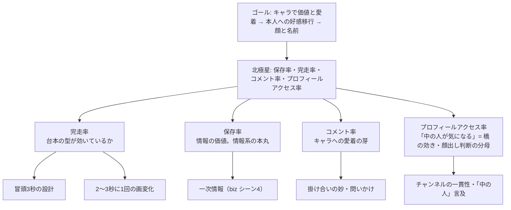

# 06. KPI・運用ルール

> 前提: [04_戦略.md](./04_戦略.md)。指標の根拠（アルゴリズム仕様）は [01_市場分析.md](./01_市場分析.md) 2章。

## 1. KPIツリー

**フォロワー数を北極星にしない。** フォロワーは遅行指標で、
先行指標（保存・完走）を上げれば後からついてくる。



### 4指標の役割分担

| 指標 | 何が分かるか | どのフェーズの主指標か |
|---|---|---|
| **完走率** | 台本の型が効いているか（**チャンネルではなく作りの問題**） | Phase 1（型の検証） |
| **保存率** | 情報として価値があるか | Phase 1（チャンネルの検証） |
| **コメント率** | キャラへの愛着が芽生えているか | Phase 1→2 の移行判定 |
| **プロフィールアクセス率** | 「中の人が気になる」＝**本人への橋の効き**（[04](./04_戦略.md) 7章） | **Phase 3（顔出し）の分母** |

**完走率が低いのはチャンネルのせいではない**ことに注意。
完走率は作りの問題なので、これが全チャンネルで低ければ**台本か画変化を疑う**
（[03](./03_トレンド調査.md) 1章）。チャンネルの優劣は**保存率とコメント率**で見る。

---

## 2. 2週間テストの判定基準

### 測るもの

| 指標 | 測り方 |
|---|---|
| 完走率 | 各PFのアナリティクス（平均視聴率） |
| 保存率 | 保存数 ÷ 表示数 |
| コメント率 | コメント数 ÷ 表示数 |
| プロフィールアクセス率 | プロフィール表示数 ÷ 表示数 |

集計は `tools/weekly_report.py` が**チャンネル別**に出す（[08](./08_自動化.md) 4章）。

### 判定の順番

```
1. 全チャンネルで完走率が低い？  → チャンネルの問題ではない。台本・画変化を直して測り直す
2. チャンネル間で保存率に差がある？ → その差がチャンネルの実力
3. コメント率とプロフィールアクセス率が高いチャンネルは？ → 本人への橋が架かり始めている
4. 迷ったら延長する
```

### 判定時に必ず思い出すこと

> ⚠️ **`meme` が勝っても、数字だけで採用しない。**
> memeの勝ちは**キャラの勝ち**であり、最終ゴール（本人への好感移行。[04](./04_戦略.md) 0章）
> からは最も遠い。採用するなら「拡散の入口」と位置づけ、girls / biz への導線設計とセットにする。
>
> ⚠️ **本数が少ないうちに決めない。** 1チャンネル4本では偶然が支配する。
> 僅差なら2週間延長する。**早く決めることより、間違った型に固定されないことが大事**。

### 絶対値の目標は置かない（いまは）

チャンネル別のベンチマークが公開されていない（[01](./01_市場分析.md) 8章）ため、
「保存率◯%を目指す」は根拠のない数字になる。

**Phase 1で測るのは絶対値ではなくチャンネル間の相対差**。
絶対値の目標は、4週分の実データが溜まった時点でここに追記する。

---

## 3. 計測・記録

- 週次で各投稿の「表示・完走率・保存・コメント・プロフィールアクセス・フォロワー増」を記録
- 記録先: `data/` に週次CSV（`data/YYYY-Www.csv`）。取得は `tools/fetch_metrics.py`
- **チャンネル（`girls` / `biz` / `meme`）別に集計する**。ここが判定の本体
  （集計キーは台本JSONの `genre` フィールド。値はチャンネル名が入る）
- 手入力列（仮説・結果メモ）は**APIの値で上書きされない**

---

## 4. 週次レビュー（30分・毎週日曜）

1. 数値を取得する（`tools/weekly_report.py`）— 自動
2. 仮説の検証結果を1行で書く（「フックに数字を入れたら完走率+8pt」等）
3. **盤の棚卸し**（`python3 tools/gh_board.py list`）— Doneの反映漏れ・詰まっている依存を見る
4. **制度変更の確認**（`biz` の過去動画が誤情報になっていないか。[03](./03_トレンド調査.md) 4章）
5. 翌週のテーマを [data/themes.md](../data/themes.md) に追記する

→ 結果は週次レビューのIssue（[#10](https://github.com/bashaka-sawabe/personal-sns-operation/issues/10)）にコメントで残す。
**会話は消えるが、リポジトリは残る。**

---

## 5. 投稿オペレーション（標準フロー）

```
テーマ（data/themes.md から）
  → 台本生成（make_video.py --script-only）                      status: draft
  → 事実確認・一次情報（人がやる。05の6章）                     status: checked
  → 動画生成（make_video.py --from-script）                      status: rendered
  → 投稿前チェックリスト（05の6章）
  → 投稿（3チャンネルへ振り分け・22時/23時の枠で公開予約）       status: posted
  → 22:00・23:00 JST にYouTubeが公開（翌朝ツールが追いつかせる） status: measuring
  → 公開直後30〜60分は手動でコメント返信
  → 48時間後に初速記録
  → 週次レビュー
```

工数目安: 12本で**生成14分＋事実確認1〜2時間**。
手作業なら12本で18〜24時間かかる。**浮いた時間は事実確認と一次情報の掘り起こしに使う。**

### 毎日の公開スロットとコメント返信ルールの両立（#168 → #237で自動化）

「投稿直後30〜60分は手動でコメント返信」を1日6本に対して6回やるのは不可能なので、
**公開の時刻を1日1スロットに束ねて、返信ウィンドウを1回にする**:

1. 10:00 `daily_run.py` が生成し、**22時と23時の枠で公開予約**までやる（自動・#237 / #239）
2. 10:00〜22:00 が取り消しの猶予。出したくない本は
   `publish_youtube.py --unreserve <video_id>` で外す（手動・任意）
3. 22:00 と 23:00 にYouTubeが公開する（各回3ch×1本 ＝ 1日6本）
4. 22:00〜24:00 が返信ウィンドウ。**全チャンネルのコメントをこの2時間で返す**

視聴者から見た「投稿時刻」は公開の瞬間なので、アルゴリズム上の初速もこのスロットに
集中する。返信は投稿本数ではなく**コメント数**に比例するため、初期（コメント1桁/本）の
うちは1時間で足りる。溢れ始めたら勝ちなので、そのとき見直す。

> 2026-08-09 以前は「限定公開で上げて、本人が `--release` でまとめて公開」だった。
> 本人指示により**公開予約まで自動化**（[docs/08](./08_自動化.md) 1章・
> [docs/09](./09_パイプライン.md) 2-3章）。レビューの関所は「公開前に止める」から
> **「公開までの12時間に外す」**に変わった。`--release`（即座に公開）は残っている。

### 投稿ステータス台帳（`data/status.csv`）

各動画がフローのどこにいるかは**台帳だけを見れば分かる**ようにする
（台本ファイルからは状態が読めない。v3期に「1本だけレンダ済み」がどこにも記録されていなかった）。

| 列 | 内容 |
|---|---|
| `video_id` / `channel` | 台本の `id` とチャンネル（`girls` / `biz` / `meme`） |
| `status` | 上のフローの5状態（`draft` → `checked` → `rendered` → `posted` → `measuring`） |
| `updated` | 状態が変わった日付 |
| `url` | 投稿URL（`posted` 以降は必須） |
| `note` | 補足（何待ちか・関連Issue） |

**ツールが確実に知っている遷移だけを機械が書く。** 人の判断が要るところは手のまま。
工程が進むたびに人が手で写していると、必ず実態とずれる。

> 行そのものも `make_video.py` が作る（#243）。生成が自動になった以上、人が足すのを
> 待つと**台帳に載らない動画**ができる。台帳の行は `--unreserve`（公開を止める唯一の
> 手段）の関所でもあるため、載っていない動画は**止めたくても止められない**。

| status | 誰が更新するか |
|---|---|
| `draft` | **人**。手で台本を起こしたときに行を足す |
| `checked` | **人**。事実確認・一次情報・チェックリストを終えた人がその場で |
| `rendered` | ツール（`make_video.py`）。**行が無ければここで作る**（#243） |
| `posted` | ツール（`publish_youtube.py`）。`url` 列と公開予定時刻も同時に書く |
| `measuring` | ツール。予約時刻が過ぎて公開されたことを**次に走った実行が検知して**進める（#237） |

状態は戻らない。投稿済みの行を作り直しで `rendered` に戻すと、公開済みかどうかが
台帳から読めなくなるため、進行方向にしか書き換えない。
台帳に無い `video_id`（旧世代の動画）は、ツールが静かに無視して先に進む。

台帳は**状態だけ**を持つ。数値は週次CSV（3章）、台本の中身は `content/scripts/` が正で、
台帳に重複して書かない（二重管理は必ずズレる）。

---

## 6. Issue運用（GitHub Project）

やることは**全てIssueにする**。詳細は [CLAUDE.md](../CLAUDE.md)。

```bash
python3 tools/gh_board.py list          # 盤の全体像（🔒=依存待ち / 👤=人手待ち）
python3 tools/gh_board.py next --auto   # 次に着手すべきIssue
python3 tools/gh_board.py doctor        # 着手前の前提チェック
```

| | |
|---|---|
| 優先度 | `P0`（他の判断の前提）〜 `P3`（次フェーズ以降）。**締切ではなく依存の深さで決める** |
| 依存 | GitHub公式の依存関係API（`Blocked by`）。**本文に文字列で書くだけでは判定に使えない** |
| ラベル | `decision`（人が数字を見て決める）/ `manual`（本人しかできない）は**自動実行しない** |
| 変更の流れ | `main` に直接pushしない。`issue-<番号>-<slug>` → PR（`Closes #N`）→ squashマージ |

投稿後は実績数値をIssueコメントに残してからClose（文脈をリポジトリに残す）。

---

## 7. リスク管理

| リスク | 対応 |
|---|---|
| **事実誤認** | 投稿前チェックリスト必須（[05](./05_コンテンツ企画.md) 5章）。一次ソースで確認。断定しない |
| **制度変更で過去動画が誤情報化** | 週次レビューで確認。古い動画は非公開にする |
| **資格の線引き** | 個別の税務・法律相談はしない。「詳細は税理士へ」を添える |
| **AI量産判定** | 一次情報を必ず乗せる（[04](./04_戦略.md) 2章）。TikTokでAIラベルを付ける。Phase 2で本人が共演する |
| **素材規約** | ずんだもん等は借り物。クレジット必須・法人接続は要許諾（[08](./08_自動化.md)）。規約変更は臨時レビュー対象 |
| 炎上 | 他クリエイター比較・専門家を貶める煽りをしない。公開データは自分の数値のみ |
| 本業への影響 | 会社名を出さない（Phase 2まで）。実名は**取り消せない**ことを前提に判断する |
| 継続断絶 | パイプラインがあるので「作れない」では止まらない。**止まるとしたら事実確認の工数**。省力運転は事実確認の軽いチャンネルに逃げるのではなく**本数を減らす**で対応する |

---

## 8. このドキュメントの更新

- 4週分の実データが溜まったら、**絶対値の目標をここに追記する**（2章）
- 判定が終わったら、判定結果と根拠をここと [00](./00_サマリー.md) に反映する
