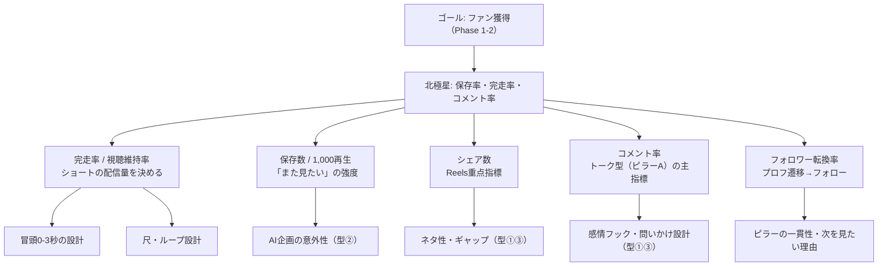

# 06. KPI・運用ルール

> 前提: [04_戦略.md](./04_戦略.md)。数値の根拠（アルゴリズム指標）は [01_市場分析.md](./01_市場分析.md) 2章。

## 1. KPIツリー

**フォロワー数を北極星にしない。** フォロワーは遅行指標であり、先行指標（保存・完走）を上げれば後からついてくる（3PF共通のアルゴリズム仕様に基づく）。



## 2. Phase 1（検証期: 8〜10月）の目標値

| 指標 | 目標 | 測り方 |
|---|---|---|
| 投稿本数 | 12本以上（週1〜2本を10週） | 投稿記録 |
| 完走率（ショート） | 60%超を安定して出せる型を1つ確立 | 各PFアナリティクス（60%は運用会社経験則の「合格」目安） |
| 保存/1,000再生 | ピラー間で比較し、最も高いピラーを特定 | 同上 |
| フォロワー | 合計1,000（ストレッチ3,000） | 3PF合計 |
| バズ | 10万再生1本（TikTokの段階配信構造上、0フォロワーでも発生し得る） | 同上 |
| コメント率（ピラーA） | 「わかる」系の共感コメントが安定して付く型を見つける | 各PFアナリティクス＋目視 |
| **最重要** | **ピラーA/Bのフォーマット優劣がデータで語れる状態になること** | 週次レビューの蓄積 |

> 注: 絶対値目標（1,000人等）は業界公開データが乏しいため保守的な仮置き。4週分の実データが溜まった時点で再設定する（このドキュメントを更新）。

## 3. 計測・記録

- 週次で各投稿の「再生数・完走率(or平均視聴維持)・保存・シェア・コメント・フォロワー増」を記録
- 記録先: 本リポジトリ `data/` に週次CSV（`data/2026-W30.csv` 形式）。集計スクリプトは追って `tools/` に自作（企画B-8と兼用）
- 月次で「ピラー別平均保存率・完走率」を算出し、ピラー配分を見直す

## 4. 週次レビュー（30分・毎週日曜）

1. 先週の投稿の数値を記録（10分）
2. 仮説の検証結果を1行で書く（「冒頭をサビにしたら完走率+8pt」等）（5分）
3. カンバン棚卸し: Current完了分→Previous、Next→Currentへ昇格、Backlogから補充（10分）
4. トレンドプール更新（[05](./05_コンテンツ企画.md) 4章の定点観測）（5分）

→ レビュー結果はGitHub Projectの該当Issueにコメントで残す（会話が消えても文脈が残る状態を保つ）。

## 5. 投稿オペレーション（標準フロー）

```
企画（Issueから選ぶ）
  → 権利チェック（J-WID/NexTone）
  → 収録（週1まとめ撮り）
  → 編集・字幕・3面書き出し
  → 投稿チェックリスト（05の5章）
  → 3PF投稿＋X告知
  → 48時間後に初速記録
  → 週次レビューで振り返り
```

工数目安: 週2本ペースで4〜6時間／省力運転（週1本）で2〜3時間。**2週連続で週0本になりそうな時は「省力運転宣言」をして型①の軽い企画に切り替える**（止めないことが最優先）。

## 6. カンバン運用ルール（GitHub Project）

- レーン: **Previous（前イテレーション）/ Current（今週）/ Next（来週）/ Backlog**
- イテレーション = 1週間（週次レビューで回す）
- Currentに置くのは**3枚まで**（稼働週3〜7時間の制約。積みすぎない）
- 企画はすべてIssue化し、投稿後は実績数値をIssueコメントに残してClose
- ラベル: `pillar:sakanaction`（A: ファントーク×ピアノ）/ `pillar:datalab`（B: AI×サカナ研究）/ `content` / `ops` / `research`（`pillar:classic` はv2で廃止）

## 7. リスク管理

| リスク | 対応 |
|---|---|
| 権利トラブル | 投稿前チェックリスト必須化（05の5章）。包括契約一覧を四半期ごとに再確認 |
| 炎上 | 他クリエイター比較・批評はしない。データ公開は自分の数値のみ。**バンド・運営・FCは叩かない（叩いていいのは自分の運だけ）**。転売話題は事実ベースのみ |
| 本業への影響 | 週次の稼働上限を守る（Current 3枚ルール）。会社名は演奏アカウントに出さない（04の8章） |
| 継続断絶 | 省力運転モードを事前定義（本ページ5章）。「休む」ではなく「軽くする」 |
| ミーム鎮火 | トレンド枠は全体の5割以下に保ち、検索資産枠（解説・定番曲）を必ず並走させる |
