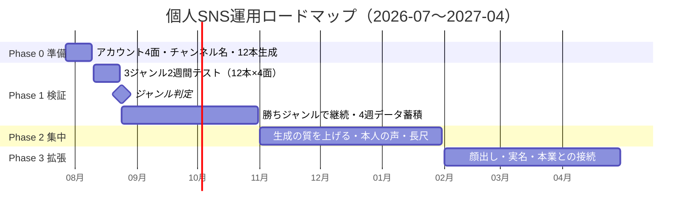

# 07. ロードマップ

> フェーズはGitHubのMilestoneと対応。個別タスクはIssue＋Project（[06](./06_KPI・運用.md) 6章）。
> **日付ではなく完了条件でフェーズを移す。** 日付が来ても未達なら延長し、原因をIssueに残す。

## Phase 0: 準備（〜2026-08-09）

**テーマ: 12本を4面に出せる状態を作る。**

| アウトプット | Issue |
|---|---|
| docsをv3に全面改訂 | [#25](https://github.com/bashaka-sawabe/personal-sns-operation/issues/25) |
| YouTubeのチャンネル名・ハンドル変更（手作業） | [#27](https://github.com/bashaka-sawabe/personal-sns-operation/issues/27) |
| 4面のアカウントとプロフィール | [#3](https://github.com/bashaka-sawabe/personal-sns-operation/issues/3) |
| 12本の生成（事実確認込み） | [#28](https://github.com/bashaka-sawabe/personal-sns-operation/issues/28) |
| Threads / Instagram の自動投稿 | [#30](https://github.com/bashaka-sawabe/personal-sns-operation/issues/30) [#31](https://github.com/bashaka-sawabe/personal-sns-operation/issues/31) |
| TikTokの投稿手順 | [#32](https://github.com/bashaka-sawabe/personal-sns-operation/issues/32) |

**完了条件**: 12本が4面すべてに出ており、数字がジャンル別に取れている。

---

## Phase 1: 検証（2026-08-10 〜 10-31）

**テーマ: どのジャンルで戦うかを数字で決める。**

### 1-A. 2週間テスト（〜08-23）

3ジャンル × 4本 × 4面。判定指標は保存率・完走率・コメント率・プロフィールアクセス率。

**完了条件（判定 = [#19](https://github.com/bashaka-sawabe/personal-sns-operation/issues/19)）**:

1. ジャンル別に4指標を並べた比較表がある
2. 勝ちジャンルを1つ決めた（僅差なら延長）
3. 判定結果を [00](./00_サマリー.md) と [04_戦略.md](./04_戦略.md) に反映した
4. 負けジャンルのテーマを [data/themes.md](../data/themes.md) から外した

> ⚠️ `trivia` が勝った場合の但し書きを必ず思い出す（[06](./06_KPI・運用.md) 2章）。

### 1-B. 勝ちジャンルで継続（〜10-31）

**完了条件**:

1. 完走率60%超を安定して出せる型が1つ以上ある
2. 4週分の実データが溜まり、**絶対値の目標を [06](./06_KPI・運用.md) に書ける**
3. コメント率の推移から、人格への移行が起きているか判断できる

---

## Phase 2: 集中（2026-11-01 〜 2027-01-31）

**テーマ: 「役に立つから見る」を「この人がやってるから見る」に変える。**

| 施策 | Issue | 狙い |
|---|---|---|
| **ナレーションを本人の声に** | [#36](https://github.com/bashaka-sawabe/personal-sns-operation/issues/36) | **顔より先に声。** 品質向上と同時に、AI量産判定の回避策そのもの（[01](./01_市場分析.md) 4章） |
| 背景を画像/動画生成AIに | [#35](https://github.com/bashaka-sawabe/personal-sns-operation/issues/35) | 2〜3秒に1回の画変化（[03](./03_トレンド調査.md) 1章） |
| 長尺（語り回）の導入 | 未起票 | Shorts → 長尺の導線が2026年に評価される（[01](./01_市場分析.md) 2-1） |
| 数字の全公開 | 未起票 | 0→1,000の全公開。共感と継続の仕掛け |
| **「実は経営者・エンジニア」の種明かし** | 未起票 | **先に使い切らない。** ここで初めて出す |

**完了条件**: 「このアカウントは◯◯」と一言で説明される状態（コメント欄で検証）。
フォロワー成長率が検証期の2倍以上。

---

## Phase 3: 拡張（2027-02-01 〜）

**テーマ: 顔と名前を出し、本業と接続する。**

### 顔出しの判断（[#38](https://github.com/bashaka-sawabe/personal-sns-operation/issues/38)）

**期限では決めない。数字で決める。**

| 指標 | 見るもの | どう取るか |
|---|---|---|
| **プロフィールアクセス率** | 「この人が気になる」の直接指標。**これが分母** | 下記 |
| コメント率 | 人格への関心の芽 | 各PFのAPI |
| リピート視聴率 | 「またこの人か」で見てもらえているか | 各PFのアナリティクス（手入力） |

**判断の材料**: 上記3指標の**4週分以上の推移**。単月では判断しない。

#### プロフィールアクセス率の中身（PFで意味が違う）

| PF | 使う数字 | 注意 |
|---|---|---|
| YouTube | **動画単位の登録者増**（`subscribersGained`） | 「プロフィールアクセス」というmetricが無いため、最も近いこれを使う |
| Instagram | media単位の `profile_visits` | 投稿種別・APIバージョンで取れないことがある |
| TikTok | 手入力 | APIが使えない |

`tools/weekly_report.py` が「/1,000表示」でジャンル別に出す。
**PFをまたいで足した絶対値には意味が薄い**ので、見るのは
**同じPF内でのジャンル間の差**と、**同じジャンルの週次の推移**。

**出す順番**: 声 → 手元 → 顔 → 実名。**一度に全部出さない**。
各段階で数字の変化を測れば、顔に価値があるのかどうかが分かる。

> **なぜ数字で決めるのか。**
> プロフィールアクセス率が上がっていない段階で顔を出しても、顔は付加価値にならず
> ただ消費される。「情報が役に立つ」から「この人だから見たい」への移行が
> 起きていることを確認してから出す。切り札は一度しか切れない。

### 実名公開

**取り消せない。** 本業（BASHAKA）との接続をどう扱うかを含めて決める。

| 選択肢 | Phase 2の結果で選ぶ |
|---|---|
| 実名＋会社名を出し、本業と接続する | 信用が本業に流れる。ただし発信の自由度が下がる |
| 顔だけ出し、実名は出さない | 中間。人格への移行は起きる |
| 出さない | 数字が条件を満たさなかった場合 |

### その他の選択肢

コラボ／収益化設計（メンバーシップ・相談）／他ジャンルへの横展開／
パイプラインそのもののナレッジ化。

収益化は広告を主目的にしない（[01](./01_市場分析.md) 5章）。
**信用の蓄積そのものが資産**。

---

## 見直しルール

- ロードマップは**月次レビューで更新**（週次は盤の棚卸しのみ）
- フェーズ移行は**完了条件ベース**。日付が来ても未達なら延長し、原因をIssueに記録する
- 大きな環境変化（アルゴリズム変更・**PFのAIポリシー変更**・制度変更）は臨時レビューを開く
