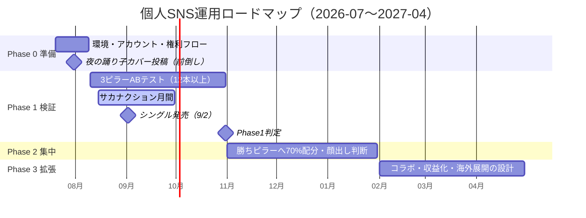

# 07. ロードマップ

> フェーズはGitHubのMilestoneと対応。個別タスクはIssue＋Project（カンバン）で管理。

## Phase 0: 準備（2026-07-20 〜 08-09）

- テーマ: **走り出せる状態を作る。ただし「夜の踊り子」だけは旬優先で前倒し投稿**（ミーム進行中のため。[03](./03_トレンド調査.md)）
- アウトプット: 撮影・録音環境確定／YT・TikTok・IGアカウント開設＋X整備／権利チェックテンプレ／計測シート／初投稿（A-1）＋ストック2本
- 完了条件: 週次レビューが1回転し、投稿→計測→記録のループが動いている

## Phase 1: 検証（2026-08-10 〜 10-31）

- テーマ: **3ピラー（サカナクション研究室／データラボ／クラシック翻訳機）をデータで比較する**
- 重点: サカナクション月間（8/15〜9/30。サマソニ→9/2シングル→9/8〜10/4ツアーの時流に乗せてピラーAを前倒し集中）
- アウトプット: 12本以上の投稿／週次レビュー10回転／ピラー別の保存率・完走率比較
- 完了条件（Phase 1判定・10月末）:
  1. どのピラーが伸びるかをデータで語れる
  2. 完走率60%超を安定して出せる「型」が1つ以上ある
  3. フォロワー合計1,000（ストレッチ3,000）※4週時点で実データに基づき再設定可
  4. 顔出しの要否を数値とコメントの質で再判断

## Phase 2: 集中（2026-11-01 〜 2027-01-31）

- テーマ: **勝ちピラーに70%配分し、伸びを最大化する**
- 施策: 投稿頻度の最適化／月1長尺（作業用・解説）の導入判断／ライブ配信のテスト／年末年始トレンド対応（紅白出場アーティスト・クリスマス曲はピアノ需要の最盛期）
- 完了条件: フォロワー成長率が検証期の2倍以上／「このアカウントは◯◯」と一言で説明される状態（コメント欄で検証）

## Phase 3: 拡張（2027-02-01 〜）

- テーマ: **資産化と広げ方の設計**
- 選択肢（Phase 2の結果で選ぶ）: コラボ（同規模の演奏系と相互出演）／楽譜販売（Piascore）・レッスンの収益化設計／英語圏展開（Golden・APT.・アニメ曲の英語タイトル運用）／HOJORIN事例としての社内ナレッジ化
- 注: 収益化は[01](./01_市場分析.md) 3章のとおりバックエンド型が定石。広告収益は主目的にしない

## 見直しルール

- ロードマップは**月次レビューで更新**（週次はカンバンのみ）
- フェーズ移行は完了条件ベース（日付が来ても未達なら延長し、原因をIssueに記録）
- 大きな環境変化（アルゴリズム変更・権利制度変更・大型トレンド）は臨時レビューを開く
